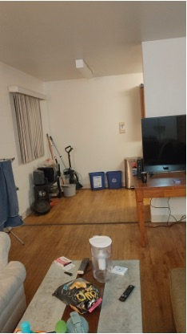
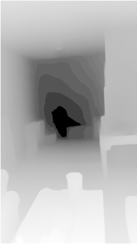
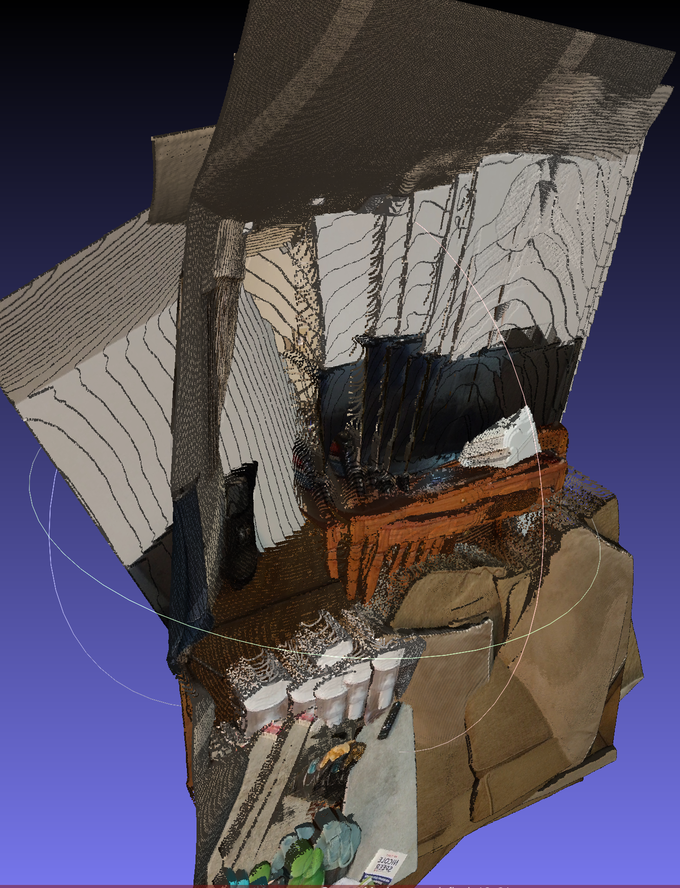

# FROM-FLAT-TO-3D
This is a repository that uses monocular depth estimation to generate 3D point clouds of video frames. The individual point clouds are in the end merged to create an independent scene representation.

# 3D Reconstruction from Monocular Video

This project reconstructs 3D point clouds from a monocular RGB video. The input video for this experiment was captured using a **Nothing Phone 3a**. Camera intrinsics for the pinhole camera model were chosen based on the phone specifications.  

## Pipeline Overview

The processing pipeline consists of four main steps:

1. **Frame Extraction:** The video is split into individual frames for processing.  
2. **Depth Estimation & Point Cloud Generation:** Each frame is processed using a monocular depth estimation model to predict depth maps, which are converted into 3D point clouds.  
3. **Point Cloud Merging:** Individual frame point clouds are merged using ICP-based registration. For this experiment, the merging threshold was set at **0.4**.  
4. **Evaluation:** The reconstructed 3D scene is evaluated using reprojection error and other metrics.  

## Sample Outputs

Below are sample outputs from the pipeline:

<table>
<tr>
<th>RGB Frame</th>
<th>Depth Map</th>
<th>Point Cloud View 1</th>
<th>Point Cloud View 2</th>
</tr>
<tr>
<td></td>
<td></td>
<td></td>
<td></td>
</tr>
</table>

**Figure:** Sample outputs from the reconstruction pipeline: (a) input RGB frame, (b) predicted depth map, and (c–d) two views of the reconstructed point cloud.

## Combined Point Cloud 

Below are sample outputs from the pipeline:

<table>
<tr>

<th>Combined Point Cloud View 1</th>
<th>Combined Point Cloud View 2</th>
</tr>
<tr>
<td></td>
<td></td>
</tr>
</table>

**Figure:** Sample outputs from the reconstruction pipeline: (a) Combined Cloud View 1, (b) Combined Cloud View 2.

## Reprojection Errors for RGB-to-Point Cloud Alignment

| Frame       | Mean Error (px) | Median Error (px) |
|------------|----------------|-----------------|
| frame_00001 | 163.21         | 142.12          |
| frame_00002 | 120.12         | 105.40          |
| frame_00003 | 130.45         | 115.30          |
| frame_00004 | 110.78         | 98.60           |
| frame_00005 | 125.90         | 110.75          |
| ...         | ...            | ...             |
| **Overall** | 147.09         | 100.25          |

